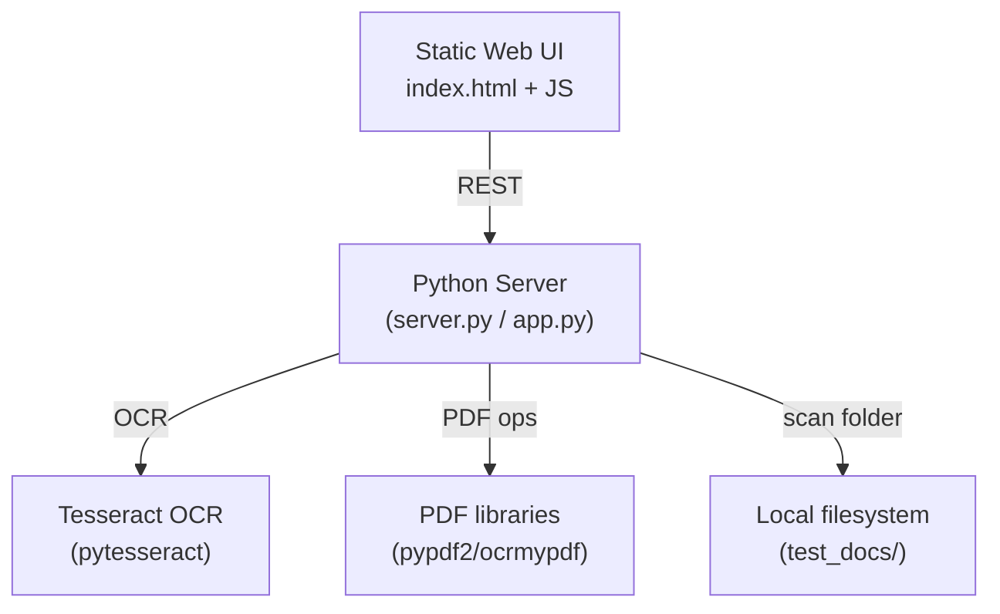
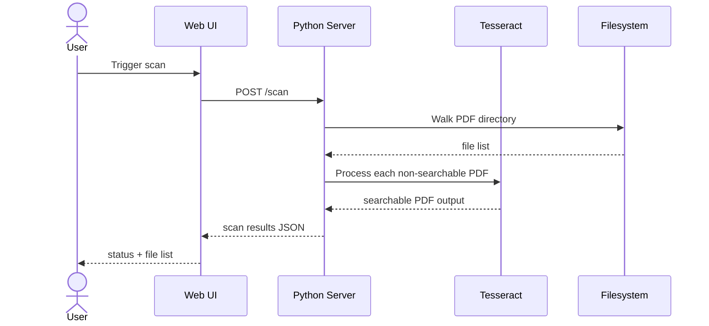
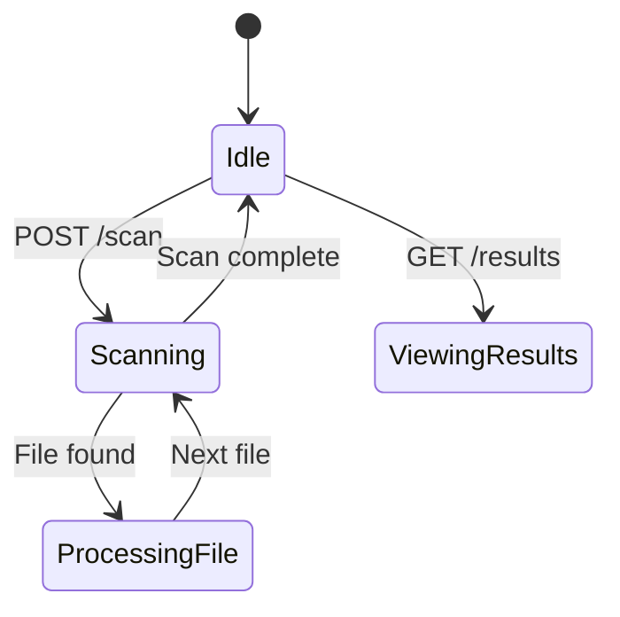

# pdfocr — Overview

## What This Is
A PDF OCR scanning and processing service with a local web UI. Scans a folder for PDFs, applies OCR to scanned (image-based) PDFs to make them text-searchable, and provides a simple browser interface for triggering scans and viewing results.

## Who It's For
Personal/home use — processing a backlog of scanned PDF documents to make them searchable.

## Problem It Solves
Automates the conversion of scanned/image PDFs to searchable text PDFs, eliminating manual OCR work.

## How It's Used
A Python server watches a folder. When triggered, it scans for non-searchable PDFs, applies Tesseract OCR, and outputs searchable versions. The web UI shows scan status and results.

## Component Stack

## Data Flow

## Behavioral Model

---
*Generated by github-repo-overview skill · Last updated: 2026-06-09 · Stack: Python + FastAPI/Flask + Tesseract OCR + Static HTML/JS*
