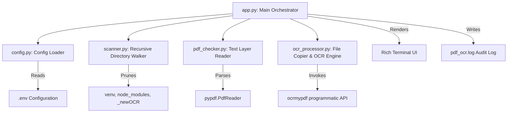

# PDF OCR Scanner and Processor

A Python application that recursively scans configured directories for PDF files, checks if they contain a machine-readable text layer, and automatically performs OCR on scanned (non-searchable) PDFs. It features live progress reporting and a clean separation between searchable and unsearchable documents.

---

## Architecture Overview

The application follows a modular architecture designed for performance, readability, and safe file I/O operations.



### Module Breakdown
- **`app.py`**: Coordinates the pipeline. Reads directories, initializes logging, runs the scanner, prints rich visual updates (progress bars and status spinners), and manages logging outputs.
- **`config.py`**: Loads and validates configurations from `.env`. Ensures that the target scan directories exist and that subfolder settings are valid.
- **`scanner.py`**: Walks target directories. It automatically ignores common package directories (like `node_modules` and `venv`) to prevent scanning slowdowns and sends live counters back to `app.py` via a callback.
- **`pdf_checker.py`**: Opens files with `pypdf` and determines if a PDF has selectable text by counting the alphanumeric character density.
- **`ocr_processor.py`**: Creates a subdirectory (default `_newOCR`) inside the document's parent folder, copies the original PDF there, and invokes the programmatic `ocrmypdf` engine to create a searchable file.

---

## User Stories

* **As an investigator / analyst**, I want to scan bulk document folders and identify scanned-only PDFs so that I can automatically convert them into searchable documents.
* **As a system administrator running on local network shares (NAS)**, I want the scanner to ignore package files (like Python virtual environments or Node dependencies) so that the indexer does not hang or scan unnecessary files.
* **As a CLI user**, I want to see a live progress count of scanned directories and found PDFs so that I can verify the application is active and running during a deep scan.
* **As a data owner**, I want my original PDF documents to remain completely untouched, with copies and OCR outputs isolated in a subfolder, to maintain the integrity of my primary archives.

---

## Capabilities
- **Case-Insensitive PDF Discovery**: Detects both `.pdf` and `.PDF` extensions recursively.
- **Dependency Directory Pruning**: Prevents traversal into massive developer folders (`node_modules`, `venv`, `.git`, `__pycache__`, etc.).
- **Lightweight Searchability Check**: Fast, pure-Python text detection without compiling external native libraries.
- **Isolated Workspace Output**: Keeps your raw files safe by performing copies and edits in dedicated `_newOCR` subfolders.
- **Rich Terminal Feedback**: Real-time rendering of folder indexing progress and percentage complete bars using the `rich` library.
- **Standardized Log Format**: Outputs a clean audit log of all successes, failures, and skipped files (already searchable).

---

## Configuration & Feature Toggles

All configurations are handled via the `.env` file in the root directory:

```env
# Comma-separated list of absolute or relative directories to scan
SCAN_DIRECTORIES=/mnt/backup/LinkedInLearning

# Name of the subfolder created for copied and OCR'd files
OCR_SUBFOLDER=_newOCR

# File path for the execution logs
LOG_FILE=pdf_ocr.log

# Language code used by Tesseract OCR (e.g. eng, spa, fra)
OCR_LANG=eng

# Feature Toggle: Force OCR (True/False)
# If True: Run OCR on every PDF found, even if it already contains text.
# If False: Skip PDFs that already contain readable text.
FORCE_OCR=False
```

---

## History of Changes (By Chat Request)

### 1. Initial Setup (Chat Request 1)
- Built the core skeleton, `.env` config structure, and programmatic scanner.
- Integrated `pypdf` for text inspection and `ocrmypdf` for OCR generation.
- Created `test_app.py` utilizing `reportlab` to generate dummy searchable and non-searchable PDFs.
- Added file logging and basic console progress bars.

### 2. Network Share Optimization & Feedback (Chat Request 2)
- Resolved terminal hangs on large Samba network shares (`/mnt/backup` mounts) by adding a live directory walk counter callback.
- Added automatic pruning for common folders (like `venv`, `node_modules`, `.git`) in `scanner.py` to prevent scanning hundreds of thousands of package files.
- Implemented a live `console.status` spinner showing: `Folders scanned | Files checked | PDFs found` as it indexes.

### 3. Visual Promotion Assets (Chat Request 3)
- Generated a high-quality product screenshot showcasing the modern dark-themed interface, progress indicators, and split document preview comparisons.
- Saved the converted asset to the root directory as `screenshot.jpg`.

---

## Installation & Setup

1. **System Prerequisites**:
   Ensure Tesseract and Ghostscript are installed on your host system:
   - *Ubuntu/Debian*: `sudo apt update && sudo apt install -y tesseract-ocr ghostscript`
   - *CentOS/RHEL/Fedora*: `sudo dnf install -y tesseract ghostscript`
   - *macOS*: `brew install tesseract ghostscript`

2. **Python Environment Setup**:
   Create and activate a virtual environment, then install Python requirements:
   ```bash
   python3 -m venv venv
   source venv/bin/activate
   pip install -r requirements.txt
   ```

3. **Running the App**:
   ```bash
   python app.py
   ```

---

## Limited FAQ & Troubleshooting

#### Q1: Why is my scan taking a long time during the "Indexing PDF files" phase?
**A**: If you are scanning the root of a large network drive (e.g., `/mnt/backup`), the SMB/CIFS network protocol requires a separate round-trip to list metadata for every directory. To speed this up:
1. Target specific directories (like `/mnt/backup/Documents`) rather than the drive root.
2. Confirm that network latency is low.

#### Q2: The app crashed or logged: `Could not find program 'tesseract' on the PATH`.
**A**: Programmatic OCR requires the Tesseract system library. Follow the steps under **System Prerequisites** to install Tesseract on your operating system, and verify that typing `tesseract --version` in your terminal runs successfully.

#### Q3: How do I run the tests?
**A**: You can execute the test suite by running:
```bash
python -m unittest test_app.py
```
To generate simulated PDF documents for manual app testing, run:
```bash
python generate_test_environment.py
```

#### Q4: Will this overwrite my original PDF files?
**A**: **No.** Original PDFs are never modified. Unsearchable PDFs are copied to the subdirectory configured as `OCR_SUBFOLDER` (e.g. `_newOCR`), and the new searchable version is generated there alongside the copy.

---

## ⚠️ Disclaimer

This repository may reference, integrate, or build upon third-party software, libraries, frameworks, or tools. Such references do not imply ownership, endorsement, or affiliation with those projects. All third-party software remains the property of its respective authors and is subject to its own license terms.

**Use of any code in this repository is entirely at your own risk.** No warranties, guarantees, or assurances of any kind are provided — express or implied — regarding fitness for purpose, security, reliability, or correctness. The author(s) of this repository accept no liability for any damages, losses, or issues arising from the use of this code or any third-party dependencies it references.

Always review third-party licenses and conduct your own due diligence before using any software in production environments.
